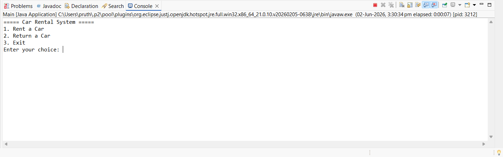
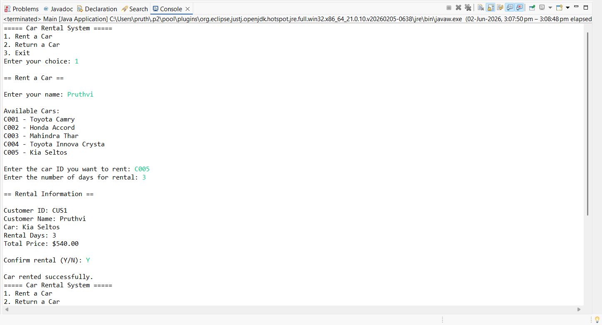
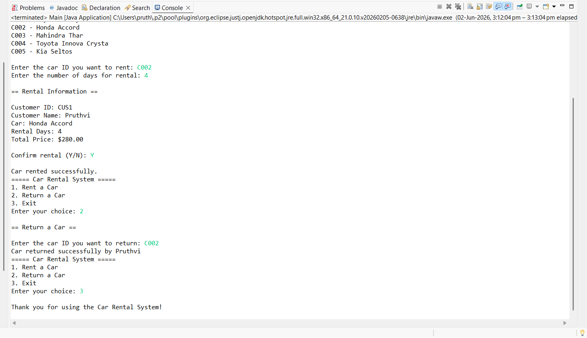

# Car-Rental-System-Java
Console-based Car Rental System developed using Java and OOP concepts.

## Features

- Rent a car
- Return a car
- View available cars
- Customer management
- Rental price calculation

## Technologies Used

- Java
- OOP Concepts
- Collections Framework
- Scanner Class

## Available Cars

| Car ID | Brand | Model |
|---------|---------|---------|
| C001 | Toyota  | Camry|
| C002 | Honda| Accord|
| C003 | Mahindra | Thar |
| C004 | Toyota | Innova Crysta |
| C005 | Kia | Seltos |

## Screenshots

### Main Menu

### Rent Car

### Return Car

## Learning Outcomes

- Object-Oriented Programming
- Class Design
- Encapsulation
- ArrayList Usage
- Real-world Project Development

## Author

Pruthvi D
